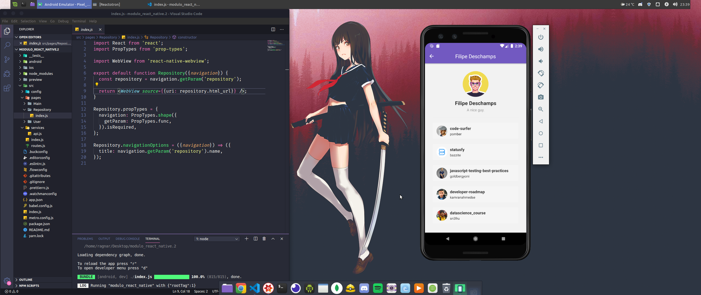
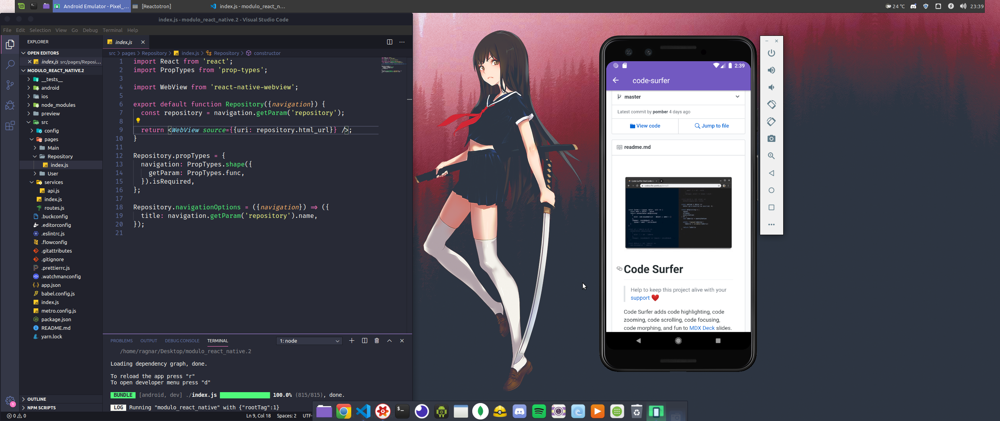

# Desafio 06 - GoStack - React-Native

Adição de funcionalidades como animação de loading de repositório, Scroll infinito e navegação com o WebView na aplicação criada durante do bootcamp.

# Instalação: 

Clone o repositório:

```bash
$ git clone https://github.com/Desafio_06_GoStack_React-Native.git
```

Dentro da pasta, abra o terminal e rode o comando:

```bash
$  yarn

```

Depois rode o comando:

```bash
$ react-native run-android
```
ou 

```bash 
react-native run-ios
``` 
e por último, rode o comando:

``'bash
yarn start.
```

Imagem da aplicação


</br>


</br>


</br>
