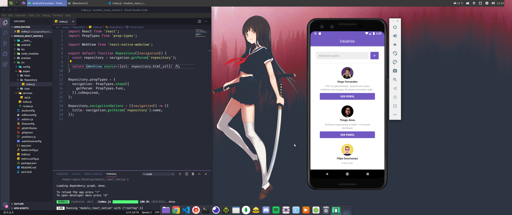

# Desafio 06 - GoStack - React-Native

Adição de funcionalidades como animação de loading de repositório, Scroll infinito e navegação com o WebView na aplicação criada durante do bootcamp.

# Instalação: 

Faça download ou clone o repositório.

Dentro da pasta, abra o terminal e rode o comando "yarn".

Depois rode o comando  "react-native run-android" ou "react-native run-ios" e por fim, rode o comando yarn start.

Imagem da aplicação

 

 

 
